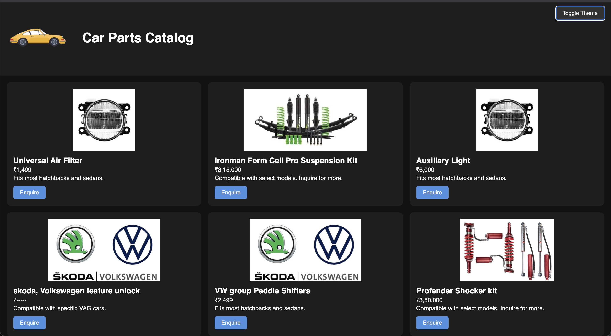

# Car Parts Catalog Website

Welcome to the **Car Parts Catalog** – a responsive and theme-switchable product display website built using HTML, CSS, and JavaScript. This project is designed for auto-parts retailers to showcase their inventory online with a modern user interface and an integrated WhatsApp enquiry system.

---

## Preview

---

## Features

- Responsive grid layout for product cards.
- Light and dark mode toggle for better user experience.
- Product listing includes image, name, description, and price.
- Integrated WhatsApp enquiry popup modal for direct communication.
- CSS variables for easy customization of theme colors.
- Smooth animations and dynamic content rendering.
- Mobile-friendly design using CSS Grid and Flexbox.

---

## Tech Stack

| Technology     | Description                                |
|----------------|--------------------------------------------|
| HTML5          | Markup for semantic page structure         |
| CSS3           | Styling using Grid, Flexbox, and variables |
| JavaScript     | Event handling, DOM manipulation, theming  |
   

---

